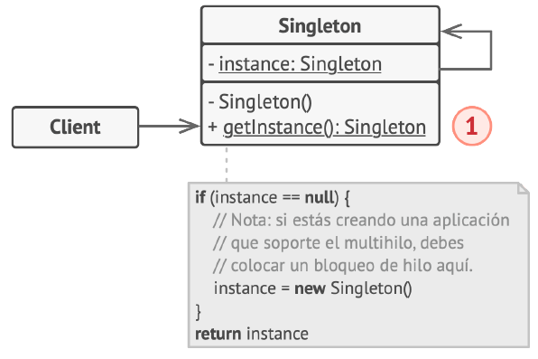
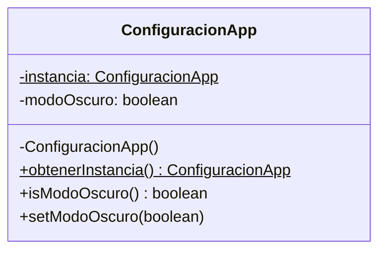
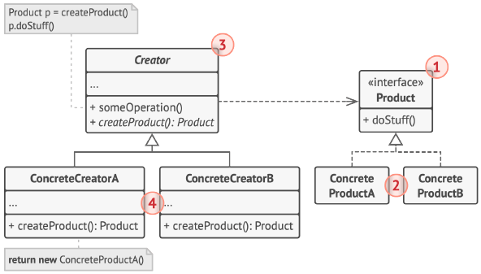
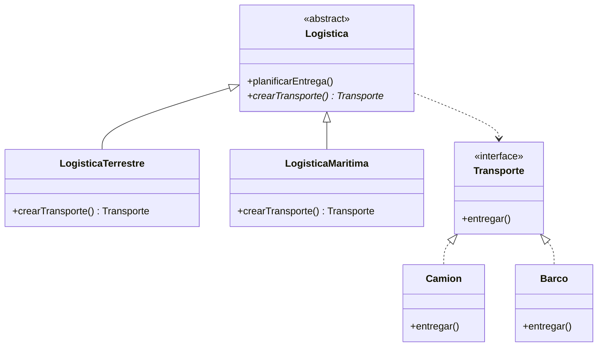
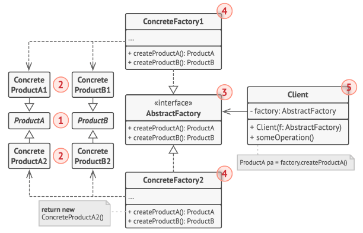
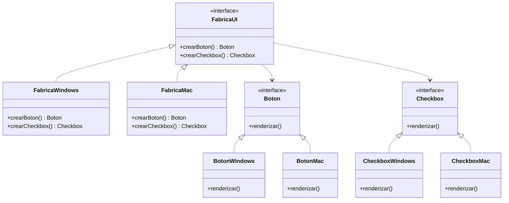
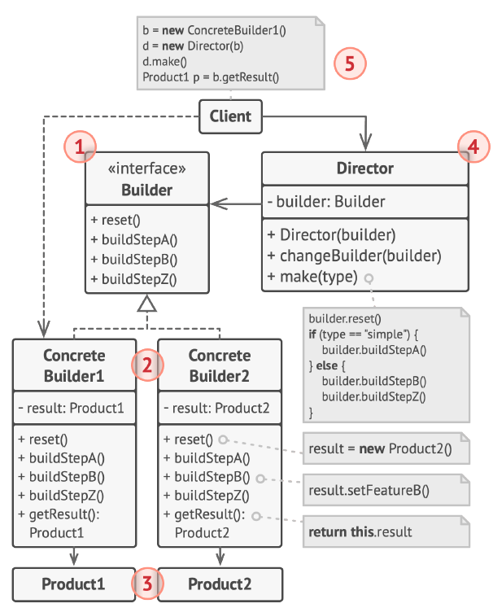
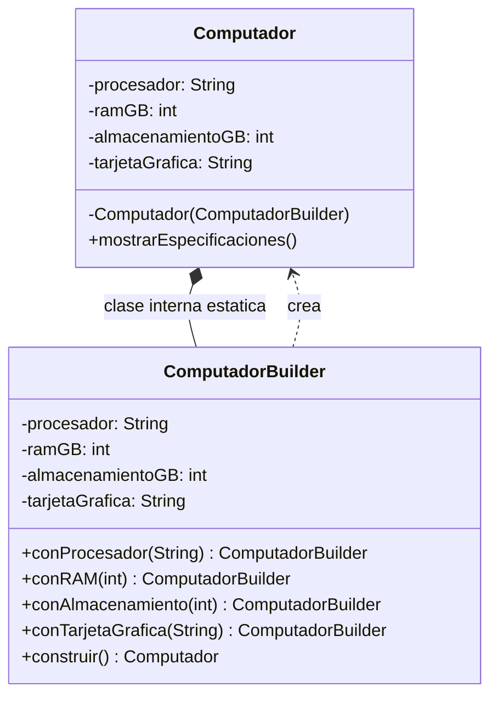
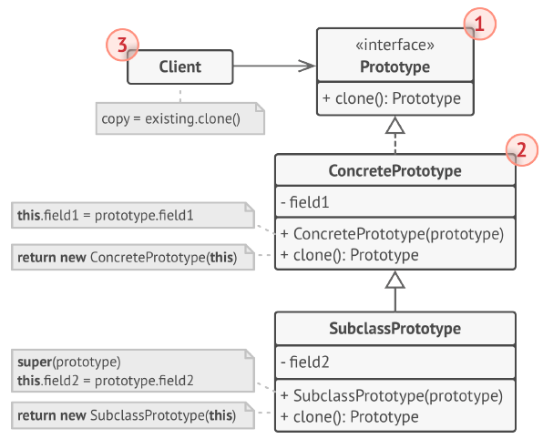
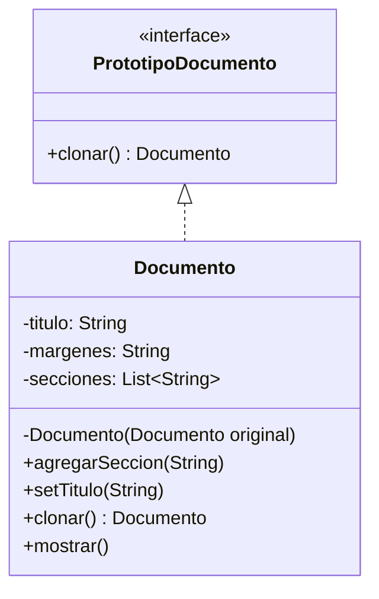

# Patrones creacionales

## ¿Qué son los patrones creacionales?

Los patrones creacionales resuelven un mismo problema de fondo: **cómo crear objetos sin acoplar el código a la forma exacta en que se crean**. En lugar de esparcir `new NombreDeClaseConcreta(...)` por todo el programa, estos patrones concentran esa lógica en un solo lugar, lo que da flexibilidad para cambiar qué se crea, cómo se crea, o cuántas instancias existen, sin tocar el resto del sistema.

En este bloque vemos los cinco patrones creacionales clásicos del catálogo GoF (Gang of Four):

1. **Singleton** — una única instancia, accesible globalmente.
2. **Factory Method** — delega la decisión de qué clase instanciar a las subclases.
3. **Abstract Factory** — crea familias completas de objetos relacionados.
4. **Builder** — construye objetos complejos paso a paso.
5. **Prototype** — crea objetos nuevos copiando uno existente.

---

## 1. Singleton

### Descripción

Garantiza que una clase tenga **una única instancia** en toda la aplicación y proporciona un **punto de acceso global** a ella.

### Estructura general



**Qué representa el número de la figura:**

1. La clase declara un método estático (típicamente `obtenerInstancia()`) que siempre devuelve la misma instancia de sí misma. Su constructor permanece oculto (privado), de modo que esa llamada al método estático es la única forma que tiene el resto del programa de obtener el objeto.

---

### El problema

Imagina que estás construyendo el sistema de configuración de una aplicación (por ejemplo, la conexión a una base de datos, o las preferencias globales del sistema). Si cualquier parte del código puede hacer `new ConfiguracionApp()`, terminas con varias instancias leyendo o escribiendo configuración de forma independiente. Un módulo cambia el modo "oscuro" a `true`, y otro módulo, que tiene su propia instancia, sigue creyendo que está en `false`. El estado se vuelve inconsistente y los recursos (como una conexión a base de datos) se duplican innecesariamente.

### La solución

Se oculta el constructor (lo hacemos `private`) para que nadie pueda crear instancias directamente, y se expone un único método estático (`obtenerInstancia()`) que crea el objeto la primera vez que se necesita y devuelve siempre esa misma instancia en adelante.

### Estructura de la solución



*(El `$` indica miembro estático: tanto `instancia` como `obtenerInstancia()` pertenecen a la clase, no a un objeto particular.)*

### Código para probar

```java
// ConfiguracionApp.java
public class ConfiguracionApp {

    // La única instancia existente. Empieza en null: todavía no se ha creado.
    private static ConfiguracionApp instancia;

    private boolean modoOscuro;
    private String idiomaPredeterminado;

    // El constructor es privado: nadie fuera de esta clase puede hacer "new".
    private ConfiguracionApp() {
        this.modoOscuro = false;
        this.idiomaPredeterminado = "es";
        System.out.println("Creando la unica instancia de ConfiguracionApp...");
    }

    // Punto de acceso global. La instancia se crea la PRIMERA VEZ que se pide.
    public static ConfiguracionApp obtenerInstancia() {
        if (instancia == null) {
            instancia = new ConfiguracionApp();
        }
        return instancia;
    }

    public boolean isModoOscuro() {
        return modoOscuro;
    }

    public void setModoOscuro(boolean modoOscuro) {
        this.modoOscuro = modoOscuro;
    }

    public String getIdiomaPredeterminado() {
        return idiomaPredeterminado;
    }
}
```

```java
// App.java
public class App {
    public static void main(String[] args) {

        ConfiguracionApp config1 = ConfiguracionApp.obtenerInstancia();
        config1.setModoOscuro(true);

        // Desde otro punto del programa, totalmente distinto:
        ConfiguracionApp config2 = ConfiguracionApp.obtenerInstancia();

        System.out.println("¿config1 y config2 son el mismo objeto? " + (config1 == config2));
        System.out.println("Modo oscuro visto desde config2: " + config2.isModoOscuro());
    }
}
```

Salida esperada:

```
Creando la unica instancia de ConfiguracionApp...
¿config1 y config2 son el mismo objeto? true
Modo oscuro visto desde config2: true
```

Nota que el mensaje "Creando la unica instancia..." se imprime **una sola vez**, aunque se llamó `obtenerInstancia()` dos veces.

### Cuándo usarlo y cuándo no

**Úsalo cuando** de verdad solo debe existir una instancia por razones del dominio: un gestor de configuración, un pool de conexiones, un registro de logs centralizado.

**Evítalo cuando** lo uses solo como una forma cómoda de tener "variables globales". El Singleton introduce estado global oculto, dificulta las pruebas unitarias (porque el estado persiste entre pruebas) y crea una dependencia implícita difícil de rastrear. En arquitecturas modernas, muchas veces se prefiere inyección de dependencias en lugar de Singleton.

---

## 2. Factory Method

### Descripción

Define un método para crear objetos, pero deja que sean las **subclases** las que decidan qué clase concreta instanciar.

### Estructura general



**Qué representa cada número de la figura:**

1. **El Producto** declara la interfaz común a todos los objetos que la clase creadora (y sus subclases) pueden producir.
2. **Los Productos Concretos** son las distintas implementaciones de esa interfaz de producto.
3. **La clase Creadora** declara el método fábrica, que retorna un objeto cuyo tipo coincide con la interfaz de producto. Este método puede declararse abstracto (obligando a cada subclase a implementar su propia versión) o tener una implementación por defecto que devuelva algún producto genérico.
4. **Los Creadores Concretos** sobreescriben el método fábrica base para que retorne un tipo distinto de producto en cada caso. Vale aclarar que ese método no siempre tiene que construir una instancia nueva: también puede devolver un objeto reutilizado desde una caché o un pool.

---

### El problema

Estás desarrollando una aplicación de logística que solo maneja transporte terrestre. Todo el código está construido alrededor de la clase `Camion`. Meses después, la empresa quiere agregar transporte marítimo. Si el código crea camiones con `new Camion()` esparcido por todas partes, agregar `Barco` implica ir a buscar cada uno de esos lugares y agregar condicionales (`if (tipo == "maritimo") ...`), arriesgando romper algo que ya funcionaba.

### La solución

Se define una clase (o interfaz) `Logistica` con un método abstracto `crearTransporte()`. Cada subclase (`LogisticaTerrestre`, `LogisticaMaritima`) decide qué tipo de transporte concreto crear. El código que usa la logística nunca necesita saber si está trabajando con un camión o un barco: solo conoce la interfaz `Transporte`.

### Estructura de la solución



### Código para probar

```java
// Transporte.java
public interface Transporte {
    void entregar();
}

// Camion.java
public class Camion implements Transporte {
    @Override
    public void entregar() {
        System.out.println("Entregando por tierra, en camion.");
    }
}

// Barco.java
public class Barco implements Transporte {
    @Override
    public void entregar() {
        System.out.println("Entregando por mar, en barco.");
    }
}
```

```java
// Logistica.java
// La clase base define el "esqueleto" del proceso y delega la creacion
// del transporte concreto a las subclases mediante el Factory Method.
public abstract class Logistica {

    public abstract Transporte crearTransporte();

    public void planificarEntrega() {
        Transporte transporte = crearTransporte();
        System.out.println("Planificando entrega...");
        transporte.entregar();
    }
}

// LogisticaTerrestre.java
public class LogisticaTerrestre extends Logistica {
    @Override
    public Transporte crearTransporte() {
        return new Camion();
    }
}

// LogisticaMaritima.java
public class LogisticaMaritima extends Logistica {
    @Override
    public Transporte crearTransporte() {
        return new Barco();
    }
}
```

```java
// App.java
public class App {
    public static void main(String[] args) {

        Logistica logisticaTerrestre = new LogisticaTerrestre();
        logisticaTerrestre.planificarEntrega();

        System.out.println();

        // Agregar transporte maritimo NO modifico Logistica, Camion, ni el codigo anterior.
        Logistica logisticaMaritima = new LogisticaMaritima();
        logisticaMaritima.planificarEntrega();
    }
}
```

### Cuándo usarlo y cuándo no

**Úsalo cuando** una clase no puede anticipar de antemano qué tipo exacto de objeto necesitará crear, o cuando quieres dar a los usuarios de tu librería o framework una forma de extender qué objetos se crean sin tocar tu código.

**Evítalo cuando** solo tienes un tipo de objeto y no hay indicios reales de que vaya a crecer: agregar una jerarquía de clases para un caso que nunca varía es sobre-ingeniería.

---

## 3. Abstract Factory

### Descripción

Proporciona una interfaz para crear **familias completas de objetos relacionados** (o dependientes entre sí) sin especificar sus clases concretas.

### Estructura general



**Qué representa cada número de la figura:**

1. **Los Productos Abstractos** declaran las interfaces de cada tipo de producto que conforma una familia relacionada.
2. **Los Productos Concretos** son las implementaciones específicas de cada producto abstracto, agrupadas por variante (por ejemplo, todos los componentes de un mismo estilo visual deben implementarse para cada variante existente).
3. **La interfaz Fábrica Abstracta** declara un método de creación por cada tipo de producto de la familia.
4. **Las Fábricas Concretas** implementan esos métodos de creación, pero cada una solo produce los productos que corresponden a una variante específica.
5. Aunque cada fábrica concreta instancia productos concretos, la firma de sus métodos siempre retorna el tipo de producto abstracto correspondiente. Gracias a eso, el código cliente nunca se acopla a una variante específica: puede trabajar con cualquier combinación de fábrica y producto siempre que se comunique a través de las interfaces abstractas.

---

### El problema

Estás construyendo una aplicación de escritorio multiplataforma. Cada botón, casilla de verificación (checkbox) y campo de texto debe verse y comportarse de forma coherente con el sistema operativo: todos los componentes deben ser "estilo Windows" o todos "estilo macOS", nunca una mezcla. Si el código crea cada componente por separado con `new BotonWindows()` o `new CheckboxMac()` según el caso, es fácil terminar mezclando estilos por error, y agregar un sistema operativo nuevo (Linux) implica revisar cada punto de creación.

### La solución

Se define una interfaz `FabricaUI` con un método por cada tipo de componente de la familia (`crearBoton()`, `crearCheckbox()`). Cada implementación concreta de la fábrica (`FabricaWindows`, `FabricaMac`) garantiza que **todos** los componentes que produce pertenecen a la misma familia visual. El código cliente solo conoce `FabricaUI`, nunca las clases concretas.

### Estructura de la solución



### Código para probar

```java
// Boton.java
public interface Boton {
    void renderizar();
}

// Checkbox.java
public interface Checkbox {
    void renderizar();
}

// BotonWindows.java
public class BotonWindows implements Boton {
    @Override
    public void renderizar() {
        System.out.println("Renderizando boton estilo Windows.");
    }
}

// BotonMac.java
public class BotonMac implements Boton {
    @Override
    public void renderizar() {
        System.out.println("Renderizando boton estilo macOS.");
    }
}

// CheckboxWindows.java
public class CheckboxWindows implements Checkbox {
    @Override
    public void renderizar() {
        System.out.println("Renderizando checkbox estilo Windows.");
    }
}

// CheckboxMac.java
public class CheckboxMac implements Checkbox {
    @Override
    public void renderizar() {
        System.out.println("Renderizando checkbox estilo macOS.");
    }
}
```

```java
// FabricaUI.java
public interface FabricaUI {
    Boton crearBoton();
    Checkbox crearCheckbox();
}

// FabricaWindows.java
public class FabricaWindows implements FabricaUI {
    @Override
    public Boton crearBoton() {
        return new BotonWindows();
    }

    @Override
    public Checkbox crearCheckbox() {
        return new CheckboxWindows();
    }
}

// FabricaMac.java
public class FabricaMac implements FabricaUI {
    @Override
    public Boton crearBoton() {
        return new BotonMac();
    }

    @Override
    public Checkbox crearCheckbox() {
        return new CheckboxMac();
    }
}
```

```java
// App.java
public class App {

    // El cliente solo conoce FabricaUI: nunca sabe si esta usando
    // componentes de Windows o de Mac.
    private static void construirInterfaz(FabricaUI fabrica) {
        Boton boton = fabrica.crearBoton();
        Checkbox checkbox = fabrica.crearCheckbox();
        boton.renderizar();
        checkbox.renderizar();
    }

    public static void main(String[] args) {
        String sistemaOperativo = "Windows"; // esto normalmente vendria detectado en tiempo de ejecucion

        FabricaUI fabrica = sistemaOperativo.equals("Windows")
                ? new FabricaWindows()
                : new FabricaMac();

        construirInterfaz(fabrica);
    }
}
```

### Cuándo usarlo y cuándo no

**Úsalo cuando** tu sistema necesita crear familias de objetos que deben usarse juntos de forma consistente, y quieres poder cambiar la familia completa (por ejemplo, de tema visual, o de proveedor de base de datos) sin tocar el código cliente.

**Evítalo cuando** los objetos que creas no tienen una relación real de "familia": si `Boton` y `Checkbox` no necesitan ser consistentes entre sí, un Factory Method simple por cada uno es más que suficiente y más simple.

---

## 4. Builder

### Descripción

Separa la **construcción** de un objeto complejo de su **representación final**, permitiendo construir el objeto paso a paso y producir distintas configuraciones del mismo proceso de construcción.

### Estructura general



**Qué representa cada número de la figura:**

1. **La interfaz Constructora** declara los pasos de construcción que comparten todos los tipos de constructores concretos.
2. **Los Constructores Concretos** ofrecen distintas implementaciones de esos pasos, y pueden incluso producir productos que no siguen una interfaz o jerarquía común entre sí.
3. **Los Productos** son los objetos resultantes de la construcción; los productos generados por distintos constructores no tienen por qué pertenecer a la misma jerarquía de clases.
4. **La clase Directora** (opcional) define el orden en el que se ejecutan los pasos de construcción, lo que permite crear y reutilizar configuraciones específicas del proceso.
5. **El Cliente** asocia un constructor concreto con la clase directora (normalmente una sola vez, a través del constructor de la directora) y deja que sea ella quien orqueste el proceso paso a paso.

---

### El problema

Tienes una clase `Computador` con muchos atributos opcionales: procesador, RAM, almacenamiento, tarjeta gráfica, si tiene WiFi, si tiene Bluetooth... Si intentas cubrir todas las combinaciones con constructores sobrecargados, terminas con un "constructor telescópico":

```java
// Esto es lo que queremos EVITAR:
new Computador("Intel i7", 16, 512, "RTX 4060", true, false, true);
// ¿Qué representa cada true/false en esa llamada? Imposible saberlo sin ir a mirar la firma.
```

Además, muchas de esas combinaciones ni siquiera tienen sentido para todos los casos, y agregar un atributo nuevo obliga a crear otro constructor sobrecargado más.

### La solución

Se crea una clase `ComputadorBuilder` con un método por cada atributo configurable, cada uno retornando `this` para poder encadenar llamadas (fluent interface), y un método final `construir()` que ensambla el objeto.

### Estructura de la solución



### Código para probar

```java
// Computador.java
public class Computador {

    private final String procesador;
    private final int ramGB;
    private final int almacenamientoGB;
    private final String tarjetaGrafica; // puede ser null si no tiene

    // El constructor es privado: solo el Builder puede construir un Computador.
    private Computador(ComputadorBuilder builder) {
        this.procesador = builder.procesador;
        this.ramGB = builder.ramGB;
        this.almacenamientoGB = builder.almacenamientoGB;
        this.tarjetaGrafica = builder.tarjetaGrafica;
    }

    public void mostrarEspecificaciones() {
        System.out.println("Procesador: " + procesador);
        System.out.println("RAM: " + ramGB + " GB");
        System.out.println("Almacenamiento: " + almacenamientoGB + " GB");
        System.out.println("Tarjeta grafica: " + (tarjetaGrafica != null ? tarjetaGrafica : "integrada"));
    }

    // El Builder vive como clase estatica interna: agrupa la construccion
    // junto a la clase que construye.
    public static class ComputadorBuilder {
        private String procesador;
        private int ramGB;
        private int almacenamientoGB;
        private String tarjetaGrafica;

        public ComputadorBuilder conProcesador(String procesador) {
            this.procesador = procesador;
            return this;
        }

        public ComputadorBuilder conRAM(int ramGB) {
            this.ramGB = ramGB;
            return this;
        }

        public ComputadorBuilder conAlmacenamiento(int almacenamientoGB) {
            this.almacenamientoGB = almacenamientoGB;
            return this;
        }

        public ComputadorBuilder conTarjetaGrafica(String tarjetaGrafica) {
            this.tarjetaGrafica = tarjetaGrafica;
            return this;
        }

        public Computador construir() {
            return new Computador(this);
        }
    }
}
```

```java
// App.java
public class App {
    public static void main(String[] args) {

        // Cada llamada se lee como una frase: queda claro que representa cada valor.
        Computador computadorGamer = new Computador.ComputadorBuilder()
                .conProcesador("Intel i7")
                .conRAM(16)
                .conAlmacenamiento(512)
                .conTarjetaGrafica("RTX 4060")
                .construir();

        Computador computadorOficina = new Computador.ComputadorBuilder()
                .conProcesador("Intel i3")
                .conRAM(8)
                .conAlmacenamiento(256)
                .construir(); // sin tarjeta grafica: se omite ese metodo

        computadorGamer.mostrarEspecificaciones();
        System.out.println();
        computadorOficina.mostrarEspecificaciones();
    }
}
```

### Cuándo usarlo y cuándo no

**Úsalo cuando** un objeto tiene muchos parámetros opcionales, o cuando la construcción implica varios pasos que se benefician de leerse como una secuencia clara.

**Evítalo cuando** el objeto tiene dos o tres atributos obligatorios y ninguno opcional: un constructor normal es más simple y no necesita esta maquinaria adicional.

---

## 5. Prototype

### Descripción

Permite copiar objetos existentes sin que el código dependa de sus clases concretas, delegando el proceso de copia al propio objeto.

### Estructura general



**Qué representa cada número de la figura:**

> El libro muestra dos variantes de este patrón. Si tu figura es la de la **implementación básica**, usa la primera lista; si es la del **registro de prototipos**, usa la segunda. Si pegaste ambas figuras, deja las dos listas.

*Implementación básica:*
1. **La interfaz Prototipo** declara el (o los) método(s) de clonación; en la mayoría de los casos, un único método `clonar()`.
2. **El Prototipo Concreto** implementa ese método: copia sus propios valores al objeto resultante y, si hace falta, resuelve casos especiales del proceso de copia (por ejemplo, objetos anidados o referencias circulares).
3. **El Cliente** puede producir una copia de cualquier objeto que cumpla la interfaz de prototipo, sin conocer su clase concreta.

*Registro de prototipos (variante extendida):*
1. **El Registro de Prototipos** centraliza el acceso a los prototipos más usados: guarda un conjunto de objetos ya configurados y listos para clonar (por ejemplo, en una tabla `nombre → prototipo`), de forma que el cliente no necesita construir cada prototipo por su cuenta.

---

### El problema

Tienes un objeto `Documento` con una configuración compleja (formato, márgenes, encabezados, pie de página, lista de secciones). Un usuario quiere crear un documento nuevo que sea casi idéntico a uno existente, con solo un par de cambios. Reconstruirlo campo por campo con un constructor es repetitivo y propenso a errores (fácil olvidar copiar algún campo), y además el código que hace la copia tendría que conocer todos los detalles internos de `Documento`.

### La solución

La clase implementa un método `clonar()` que sabe cómo copiarse a sí misma, incluyendo sus atributos internos. Quien necesita una copia no necesita conocer la estructura interna del objeto: solo le pide que se clone.

### Estructura de la solución



### Código para probar

```java
// PrototipoDocumento.java
public interface PrototipoDocumento {
    Documento clonar();
}

// Documento.java
import java.util.ArrayList;
import java.util.List;

public class Documento implements PrototipoDocumento {

    private String titulo;
    private String margenes;
    private List<String> secciones;

    public Documento(String titulo, String margenes) {
        this.titulo = titulo;
        this.margenes = margenes;
        this.secciones = new ArrayList<>();
    }

    public void agregarSeccion(String seccion) {
        secciones.add(seccion);
    }

    public void setTitulo(String titulo) {
        this.titulo = titulo;
    }

    // Constructor de copia: usado internamente por clonar().
    private Documento(Documento original) {
        this.titulo = original.titulo;
        this.margenes = original.margenes;
        // Copia PROFUNDA de la lista: si copiaramos la referencia,
        // ambos documentos terminarian compartiendo la misma lista de secciones.
        this.secciones = new ArrayList<>(original.secciones);
    }

    @Override
    public Documento clonar() {
        return new Documento(this);
    }

    public void mostrar() {
        System.out.println("Titulo: " + titulo);
        System.out.println("Margenes: " + margenes);
        System.out.println("Secciones: " + secciones);
    }
}
```

```java
// App.java
public class App {
    public static void main(String[] args) {

        Documento plantillaInforme = new Documento("Informe mensual", "2.5 cm");
        plantillaInforme.agregarSeccion("Introduccion");
        plantillaInforme.agregarSeccion("Resultados");
        plantillaInforme.agregarSeccion("Conclusiones");

        // Clonamos la plantilla en lugar de reconstruirla desde cero.
        Documento informeSeptiembre = plantillaInforme.clonar();
        informeSeptiembre.setTitulo("Informe septiembre 2026");
        informeSeptiembre.agregarSeccion("Anexos");

        System.out.println("--- Plantilla original ---");
        plantillaInforme.mostrar();

        System.out.println("\n--- Copia modificada ---");
        informeSeptiembre.mostrar();
    }
}
```

Salida esperada (nota que la plantilla original no se ve afectada por los cambios en la copia, gracias a la copia profunda de la lista):

```
--- Plantilla original ---
Titulo: Informe mensual
Margenes: 2.5 cm
Secciones: [Introduccion, Resultados, Conclusiones]

--- Copia modificada ---
Titulo: Informe septiembre 2026
Margenes: 2.5 cm
Secciones: [Introduccion, Resultados, Conclusiones, Anexos]
```

### Cuándo usarlo y cuándo no

**Úsalo cuando** crear un objeto desde cero es costoso (por tiempo, por recursos, o por complejidad de configuración) y ya tienes una instancia similar de la que partir, o cuando quieres evitar que el código cliente dependa de las clases concretas para copiar objetos.

**Evítalo cuando** la copia superficial (compartir referencias) sea suficiente y no haya riesgo de que dos objetos terminen modificando accidentalmente el mismo dato interno; en ese caso, un constructor de copia simple basta y el patrón añade complejidad innecesaria.

---

## Resumen comparativo

| Patrón | Resuelve... | Mecanismo típico en Java |
|---|---|---|
| **Singleton** | Garantizar una única instancia global | Constructor privado + método estático |
| **Factory Method** | Delegar qué clase concreta instanciar | Método abstracto sobreescrito por subclases |
| **Abstract Factory** | Crear familias completas y consistentes de objetos | Interfaz con un método de creación por producto |
| **Builder** | Construir objetos complejos paso a paso | Clase builder con métodos encadenados |
| **Prototype** | Crear objetos copiando uno existente | Método `clonar()` con copia profunda |
