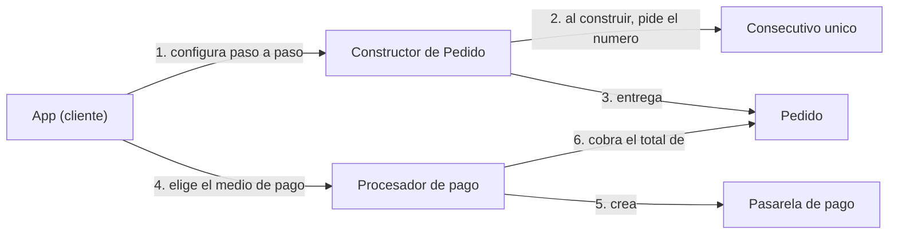

# Taller integrador: patrones creacionales

## DomiExpress, el sistema de pedidos a domicilio

| | |
|---|---|
| **Patrones** | Singleton + Builder + Factory Method (reto extra: Prototype) |
| **Modalidad** | Parejas |
| **Duración sugerida** | 2 sesiones de 2 horas (una de construcción, otra de ajustes y sustentación) |
| **Lenguaje** | Java 11 o superior |
| **Antes de empezar** | Haber leído la guía de patrones creacionales (Singleton, Factory Method, Builder y Prototype) |

---

## 1. Objetivo

Hasta ahora viste cada patrón por separado, con su propio ejemplo. En un proyecto real casi nunca aparecen solos: un mismo flujo suele necesitar **un objeto único**, **un objeto complejo de armar** y **un objeto que cambia según el contexto**, todo a la vez.

En este taller vas a construir un mini sistema de pedidos donde los tres patrones colaboran. Al terminar deberías poder:

- Decidir **cuál patrón corresponde** a cada necesidad de diseño y justificarlo.
- Implementar Singleton, Builder y Factory Method **trabajando juntos** (no como ejercicios aislados).
- Demostrar con código que tu diseño **se puede extender sin modificar clases existentes**.

---

## 2. Contexto

**DomiExpress** es una plataforma (inventada para este taller) donde los clientes piden comida para recoger en el local o para recibir a domicilio. Cada pedido tiene un número único, varios datos (algunos obligatorios y otros opcionales) y se paga con distintos medios: tarjeta, PSE o efectivo. El equipo ya sabe que pronto llegarán más medios de pago, como Nequi.

---

## 3. El problema (cómo lo haría alguien sin patrones)

Así se vería el código de un equipo que todavía no conoce estos patrones:

```java
// Un contador suelto, repetido en cada clase que necesita numerar algo
private static int contador = 0;

// Constructor con 8 parametros: ¿que significa cada uno? ¿cual es opcional?
Pedido p = new Pedido("PED-" + (++contador), "Ana Torres", "DOMICILIO",
        "Cra 7 # 45-10", items, "", 10, 3000);

// Cada medio de pago nuevo obliga a tocar este bloque
if (medioPago.equals("TARJETA")) {
    // cobrar con tarjeta ...
} else if (medioPago.equals("PSE")) {
    // cobrar con PSE ...
} else if (medioPago.equals("EFECTIVO")) {
    // cobrar en efectivo ...
}
```

Antes de escribir una sola línea de tu solución, anota con tu pareja **tres problemas concretos** que ve cada uno en este fragmento. Te servirán para la sustentación.

---

## 4. Requisitos

**R1. Consecutivo único.** Cada pedido válido recibe un número con el formato `PED-0001`, `PED-0002`, etc. Debe existir **una sola fuente** de numeración en todo el programa. Un pedido que se rechaza por inválido **no consume número**.

**R2. Pedido con datos obligatorios y opcionales.**

| Dato | Obligatorio | Valor por defecto |
|---|---|---|
| Cliente | Sí | (sin valor) |
| Tipo de entrega (`RECOGER` o `DOMICILIO`) | No | `RECOGER` |
| Dirección | Solo si la entrega es `DOMICILIO` | vacía |
| Ítems (al menos uno) | Sí | lista vacía |
| Notas | No | vacías |
| Cupón (porcentaje de 0 a 100) | No | 0 |
| Propina | No | 0 |

**R3. Validación al construir.** Si falta algo obligatorio, el pedido no se crea y se lanza `IllegalStateException` con estos mensajes exactos, evaluados en este orden:

1. `El cliente es obligatorio`
2. `El pedido debe tener al menos un item`
3. `El domicilio requiere direccion`

Un cupón fuera del rango 0 a 100 lanza `IllegalArgumentException` con el mensaje `El cupon debe estar entre 0 y 100`.

**R4. Total del pedido.**

```
total = subtotal * (100 - cupon) / 100 + propina
```

donde `subtotal` es la suma de `precio * cantidad` de todos los ítems.

**R5. Medios de pago.** Todos siguen el mismo flujo (crear la pasarela, mostrar qué se va a cobrar, cobrar, informar el resultado). Lo único que cambia es la pasarela:

| Medio | Regla de aprobación |
|---|---|
| Tarjeta | Aprueba si el total es menor o igual a 500000 |
| PSE | Aprueba siempre |
| Efectivo | Aprueba siempre |

**R6. Extensión sin modificar.** Agrega **Nequi** (aprueba si el total es menor o igual a 300000) **sin editar ninguna clase que ya hayas escrito**. Si tuviste que modificar una clase existente, revisa tu diseño.

---

## 5. Mapa de colaboración

Este diagrama **no es** el diagrama de clases: solo muestra quién le pide qué a quién. Tu trabajo es decidir qué clases e interfaces hacen falta para que esto funcione.



Preguntas para guiar tus decisiones de diseño (no las respondas todavía, úsalas mientras diseñas):

| Necesidad | Pregunta guía |
|---|---|
| Numeración de pedidos | ¿Cuántos generadores deberían existir? ¿Qué pasaría si hubiera dos? |
| Pedido con 7 datos, algunos opcionales | ¿Qué le pasa a un constructor con tantos parámetros cuando se agrega un dato nuevo? |
| Medios de pago intercambiables | ¿Qué parte del flujo cambia entre medios y cuál se repite siempre? |
| Agregar Nequi | ¿Dónde tendrías que escribir código nuevo? ¿Dónde **no** deberías tocar nada? |

---

## 6. Código de partida (te lo damos hecho)

Crea un proyecto Java nuevo, pega estos archivos en `src` y escribe tú el resto.

```java
// TipoEntrega.java
public enum TipoEntrega {
    RECOGER,
    DOMICILIO
}
```

```java
// ItemPedido.java
public class ItemPedido {

    private final String nombre;
    private final double precioUnitario;
    private final int cantidad;

    public ItemPedido(String nombre, double precioUnitario, int cantidad) {
        this.nombre = nombre;
        this.precioUnitario = precioUnitario;
        this.cantidad = cantidad;
    }

    public String getNombre() {
        return nombre;
    }

    public double getPrecioUnitario() {
        return precioUnitario;
    }

    public int getCantidad() {
        return cantidad;
    }

    public double getSubtotal() {
        return precioUnitario * cantidad;
    }
}
```

```java
// PasarelaPago.java
public interface PasarelaPago {
    String nombre();

    boolean cobrar(double monto);
}
```

---

## 7. Contrato de clases

`App.java` (sección siguiente) **no se modifica**. Para que compile, tus clases deben ofrecer exactamente esto:

| Clase | Lo que `App` necesita |
|---|---|
| `GeneradorConsecutivo` | `static GeneradorConsecutivo obtenerInstancia()` y `String siguiente()`. Al crearse por primera vez imprime `[Consecutivo] Instancia creada.` |
| `Pedido` | `String getId()`, `double calcularTotal()`, `void mostrarResumen()` |
| `Pedido.Builder` (clase interna estática) | `conCliente(String)`, `conTipoEntrega(TipoEntrega)`, `conDireccion(String)`, `agregarItem(ItemPedido)`, `conNotas(String)`, `conCupon(int)`, `conPropina(double)`, `Pedido construir()`. Todos los `con...` y `agregarItem` devuelven el propio Builder |
| `ProcesadorPago` | `void procesar(Pedido)`. Es la clase **creadora** de tu Factory Method |
| `ProcesadorTarjeta`, `ProcesadorPSE`, `ProcesadorEfectivo` | Constructor público sin parámetros |
| `ProcesadorNequi` | Lo creas en el punto 4 (R6) |

Reglas de diseño que se evalúan además de que compile:

- El constructor de `Pedido` debe ser **privado**: la única forma de obtener un `Pedido` es el Builder.
- El constructor de `GeneradorConsecutivo` debe ser **privado**.
- `ProcesadorPago` **no puede contener** `if` o `switch` que pregunten por el tipo de medio de pago.
- `procesar` debe estar escrito **una sola vez**, en la clase base.

---

## 8. `App.java` (no se modifica)

```java
public class App {

    public static void main(String[] args) {

        System.out.println("=== 1. Singleton: consecutivo unico ===");
        GeneradorConsecutivo g1 = GeneradorConsecutivo.obtenerInstancia();
        GeneradorConsecutivo g2 = GeneradorConsecutivo.obtenerInstancia();
        System.out.println("g1 y g2 son el mismo objeto: " + (g1 == g2));

        System.out.println();
        System.out.println("=== 2. Builder: construccion de pedidos ===");

        Pedido p1 = new Pedido.Builder()
                .conCliente("Ana Torres")
                .conTipoEntrega(TipoEntrega.DOMICILIO)
                .conDireccion("Cra 7 # 45-10, Bogota")
                .agregarItem(new ItemPedido("Bandeja paisa", 28000, 1))
                .agregarItem(new ItemPedido("Limonada", 6000, 2))
                .conCupon(10)
                .conPropina(3000)
                .construir();
        p1.mostrarResumen();

        Pedido p2 = new Pedido.Builder()
                .conCliente("Luis Perez")
                .conTipoEntrega(TipoEntrega.RECOGER)
                .agregarItem(new ItemPedido("Empanada", 3500, 4))
                .conNotas("Sin aji")
                .construir();
        p2.mostrarResumen();

        // Pedidos invalidos: deben ser rechazados SIN consumir un numero de pedido.
        try {
            new Pedido.Builder()
                    .conCliente("Marta Gomez")
                    .construir();
        } catch (IllegalStateException e) {
            System.out.println("Pedido rechazado: " + e.getMessage());
        }

        try {
            new Pedido.Builder()
                    .conCliente("Pedro Ruiz")
                    .conTipoEntrega(TipoEntrega.DOMICILIO)
                    .agregarItem(new ItemPedido("Jugo", 5000, 1))
                    .construir();
        } catch (IllegalStateException e) {
            System.out.println("Pedido rechazado: " + e.getMessage());
        }

        Pedido p3 = new Pedido.Builder()
                .conCliente("Empresa Andina")
                .agregarItem(new ItemPedido("Combo familiar", 30000, 20))
                .construir();
        p3.mostrarResumen();

        System.out.println();
        System.out.println("=== 3. Factory Method: medios de pago ===");

        ProcesadorPago tarjeta = new ProcesadorTarjeta();
        ProcesadorPago pse = new ProcesadorPSE();
        ProcesadorPago efectivo = new ProcesadorEfectivo();

        tarjeta.procesar(p1);
        efectivo.procesar(p2);
        tarjeta.procesar(p3);   // supera el limite de la tarjeta
        pse.procesar(p3);       // PSE si lo aprueba

        // INICIO PUNTO 4 (descomenta cuando hayas creado ProcesadorNequi)
        // System.out.println();
        // System.out.println("=== 4. Extension sin modificar codigo existente ===");
        // ProcesadorPago nequi = new ProcesadorNequi();
        // nequi.procesar(p2);
        // nequi.procesar(p3);
        // FIN PUNTO 4
    }
}
```

---

## 9. Salida de referencia

El formato de `mostrarResumen()` puede variar un poco entre parejas. Lo que **no** puede variar son los **valores**, el **orden** de las líneas y los **mensajes de rechazo**.

```
=== 1. Singleton: consecutivo unico ===
[Consecutivo] Instancia creada.
g1 y g2 son el mismo objeto: true

=== 2. Builder: construccion de pedidos ===
Pedido PED-0001 | Cliente: Ana Torres | Entrega: DOMICILIO (Cra 7 # 45-10, Bogota)
  - 1 x Bandeja paisa ($28000)
  - 2 x Limonada ($6000)
  Cupon: 10% | Propina: $3000 | Total: $39000
Pedido PED-0002 | Cliente: Luis Perez | Entrega: RECOGER
  - 4 x Empanada ($3500)
  Notas: Sin aji
  Cupon: 0% | Propina: $0 | Total: $14000
Pedido rechazado: El pedido debe tener al menos un item
Pedido rechazado: El domicilio requiere direccion
Pedido PED-0003 | Cliente: Empresa Andina | Entrega: RECOGER
  - 20 x Combo familiar ($30000)
  Cupon: 0% | Propina: $0 | Total: $600000

=== 3. Factory Method: medios de pago ===
Procesando PED-0001 con Tarjeta por $39000
  -> Pago APROBADO
Procesando PED-0002 con Efectivo por $14000
  -> Pago APROBADO
Procesando PED-0003 con Tarjeta por $600000
  -> Pago RECHAZADO
Procesando PED-0003 con PSE por $600000
  -> Pago APROBADO
```

Fíjate en un detalle: el tercer pedido válido es `PED-0003`, aunque antes hubo **dos intentos rechazados**. Si tu salida dice `PED-0005`, estás pidiendo el número demasiado pronto.

Cuando completes el punto 4 (R6) y descomentes el bloque, la salida debe terminar con:

```
=== 4. Extension sin modificar codigo existente ===
Procesando PED-0002 con Nequi por $14000
  -> Pago APROBADO
Procesando PED-0003 con Nequi por $600000
  -> Pago RECHAZADO
```

---

## 10. Reto extra: Prototype (+3 puntos)

DomiExpress quiere un botón **"Repetir mi último pedido"**. Agrega a `Pedido` los métodos `Pedido clonar()` y `void agregarItem(ItemPedido)` cumpliendo estas reglas:

- El clon recibe un **número de pedido nuevo** (pídelo al Singleton).
- Copia cliente, tipo de entrega, dirección, notas, propina e ítems.
- **No copia el cupón** (los cupones son de un solo uso, el clon queda con 0%).
- Agregar un ítem al clon **no debe alterar el pedido original**.

Prueba con este programa aparte:

```java
public class AppBonus {

    public static void main(String[] args) {

        System.out.println("=== Reto extra: Prototype (repetir pedido) ===");

        Pedido original = new Pedido.Builder()
                .conCliente("Ana Torres")
                .conTipoEntrega(TipoEntrega.DOMICILIO)
                .conDireccion("Cra 7 # 45-10, Bogota")
                .agregarItem(new ItemPedido("Bandeja paisa", 28000, 1))
                .conCupon(10)
                .conPropina(3000)
                .construir();

        Pedido repetido = original.clonar();
        repetido.agregarItem(new ItemPedido("Postre", 8000, 1));

        System.out.println("-- Original --");
        original.mostrarResumen();
        System.out.println("-- Repetido (copia con un item extra) --");
        repetido.mostrarResumen();
    }
}
```

Salida de referencia:

```
=== Reto extra: Prototype (repetir pedido) ===
[Consecutivo] Instancia creada.
-- Original --
Pedido PED-0001 | Cliente: Ana Torres | Entrega: DOMICILIO (Cra 7 # 45-10, Bogota)
  - 1 x Bandeja paisa ($28000)
  Cupon: 10% | Propina: $3000 | Total: $28200
-- Repetido (copia con un item extra) --
Pedido PED-0002 | Cliente: Ana Torres | Entrega: DOMICILIO (Cra 7 # 45-10, Bogota)
  - 1 x Bandeja paisa ($28000)
  - 1 x Postre ($8000)
  Cupon: 0% | Propina: $3000 | Total: $39000
```

Si el original también muestra el postre, tu copia es superficial (comparten la misma lista).

---

## 11. Entregables

1. **Código fuente** del proyecto en GitHub que compile y reproduzca la salida de referencia.
2. **Diagrama de clases** de **tu** solución (Mermaid, draw.io o similar), donde se identifique a qué patrón pertenece cada clase.
3. **Justificación escrita** (máximo una página): un párrafo por patrón explicando **qué problema del fragmento de la sección 3 resuelve** y **un caso donde no lo usarías**.
4. **Captura de la salida** de `App` con el punto 4 activado.

---

## 12. Rúbrica (50 puntos)

| Criterio | Puntos |
|---|---|
| **Singleton**: constructor privado, acceso estático, una sola instancia, los pedidos rechazados no consumen número | 8 |
| **Builder**: API fluida, valores por defecto, validación al construir con los mensajes exactos, constructor de `Pedido` privado | 12 |
| **Factory Method**: creadora abstracta con el flujo común escrito una sola vez, productos, tres creadores concretos, sin `if` por tipo de pago | 12 |
| **Extensión (R6)**: Nequi agregado sin modificar ninguna clase existente | 4 |
| **Salida**: coincide con la de referencia (valores, orden y mensajes) | 4 |
| **Diagrama de clases**: correcto y con los patrones identificados | 4 |
| **Justificación escrita**: clara, ligada al problema real y con el caso de "cuándo no" | 6 |
| **Total** | **50** |
| *Reto extra Prototype* | *+3 (sin superar los 50)* |

---

## 13. Preguntas para la sustentación

Cada integrante responde al menos una, y el docente puede elegir cuál:

1. ¿Por qué el consecutivo es un Singleton y no una variable `static` dentro de `Pedido`? ¿En qué se parecen y en qué se diferencian las dos opciones?
2. Si dos hilos llaman a `obtenerInstancia()` al mismo tiempo la primera vez, ¿qué podría salir mal? ¿Cómo lo resolverían?
3. ¿Por qué el número de pedido se pide dentro de `construir()` **después** de validar y no al empezar a armar el pedido?
4. Si mañana el pedido recibe cinco datos opcionales más, ¿qué tendrían que cambiar con su Builder? ¿Y con un constructor tradicional?
5. Al agregar Nequi, ¿cuántos archivos nuevos escribieron y cuántos existentes tocaron? ¿Qué relación tiene eso con el principio abierto/cerrado de SOLID?
6. Si la empresa solo aceptara tarjeta para siempre, ¿seguirían usando Factory Method? ¿Por qué sí o por qué no?

---

## 14. Errores comunes (revísalos antes de entregar)

- Dejar `new GeneradorConsecutivo()` accesible desde fuera de la clase (el constructor debe ser privado).
- Pedir el consecutivo antes de validar el pedido, de modo que los rechazados "gastan" números.
- Poner la lógica de cobro dentro de `ProcesadorTarjeta`, `ProcesadorPSE`, etc. en vez de dejar el flujo común en la clase base.
- Usar un `if (tipo.equals("TARJETA"))` dentro de `ProcesadorPago`: eso es justo lo que el patrón debe eliminar.
- Reutilizar un mismo `Pedido.Builder` para armar dos pedidos distintos (arrastra los ítems del anterior).
- (Reto extra) Copiar la referencia de la lista de ítems en el clon en lugar de copiar su contenido.
